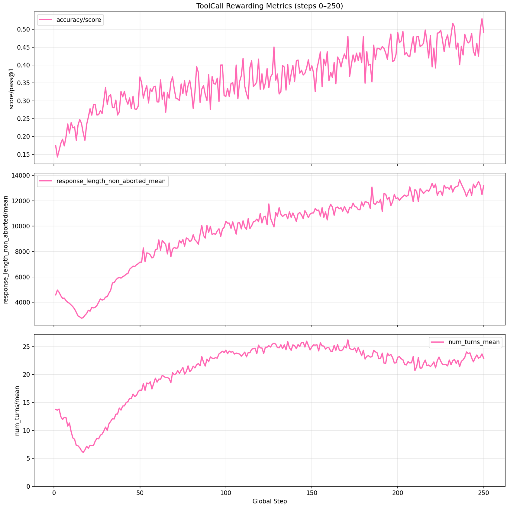
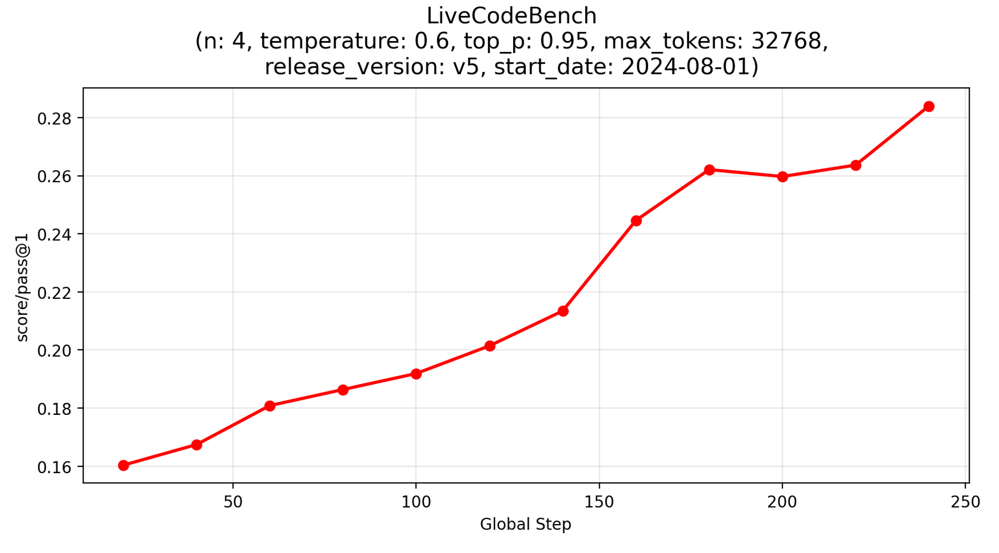
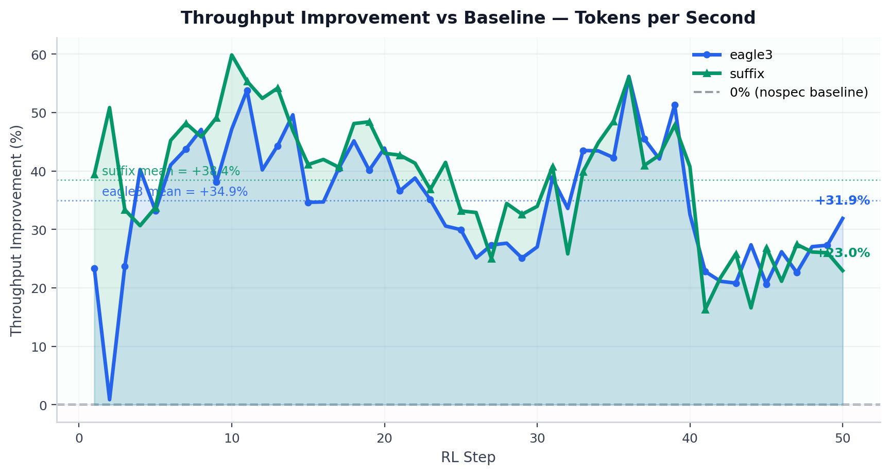
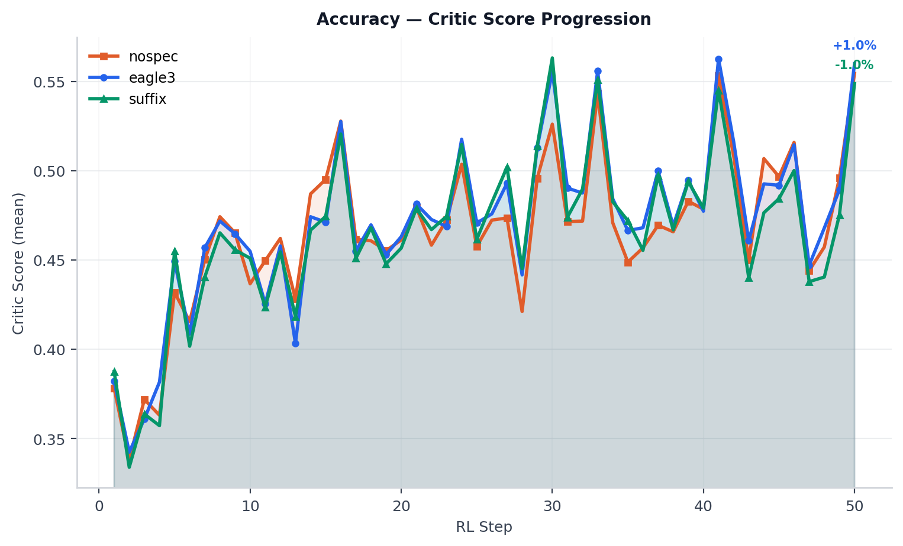
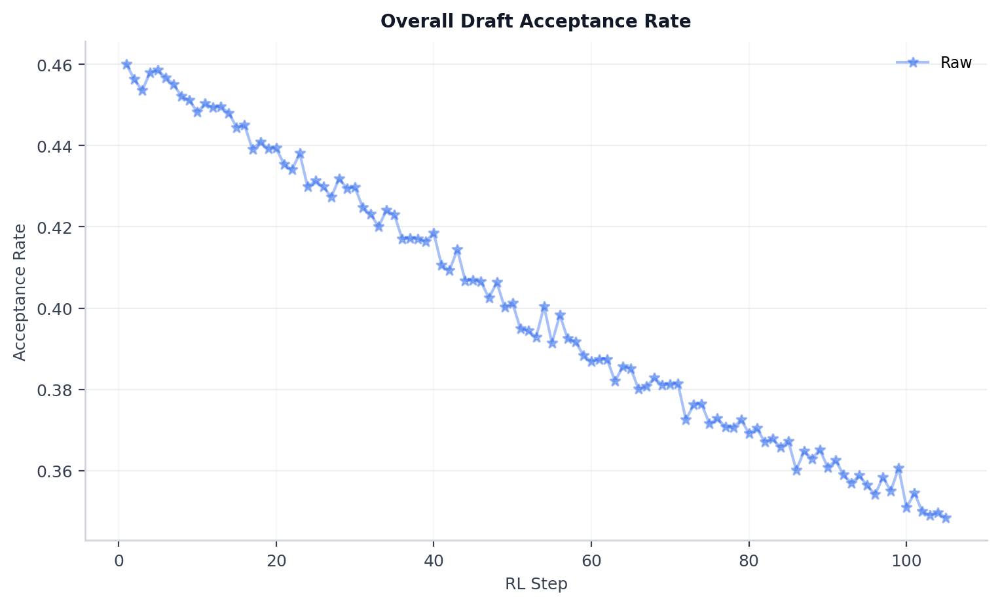

# Code RL with Multi-Turn Tool Calling on Ascend NPUs

## Overview

This project is based on the Qwen3-1.7B model, employing the [verl](https://github.com/volcengine/verl) reinforcement learning framework and the [ScaleBox](https://gitcode.com/icip-cas/ScaleBox) code sandbox service adapted for the Ascend platform, achieving efficient and stable ***long-context multi-turn tool-call Code RL*** training. Our contributions include:

1. Developed a scalable distributed code execution sandbox ScaleBox, supporting large-scale multi-node deployment, mainstream RL framework compatibility, and efficient unified evaluation across multiple models and benchmarks.
2. Provided a unified deployment image combining verl and ScaleBox, supporting co-deployment of ScaleBox service and verl training tasks on a single node, with zero-cost migration to Huawei Cloud [ModelArts](https://www.huaweicloud.com/product/modelarts.html).
3. Validated Code RL training using the verl framework and ScaleBox sandbox on Ascend NPUs.
4. Organized SFT data and SFT strategy for Coding Toolcall, and introduced multi-turn tool-call Coding Agent training in RL (the first open-source verl-based Coding Agent RL Recipe supporting multi-turn tool calling).
5. Patches to integrate speculative decoding (EAGLE3 and Suffix) into the verl + vLLM-Ascend rollout pipeline, with per-step metrics collection — draft token count, accepted token count, draft acceptance rate, mean acceptance length, and per-position acceptance rates.
6. Validation of EAGLE3 speculative decoding within the multi-turn tool-call Code RL training loop on Ascend NPUs, achieving **30% improvement in end-to-end throughput** and **25% reduction in training step time** without loss of accuracy.

[ScaleBox](https://gitcode.com/icip-cas/ScaleBox) 是一个可扩展的分布式代码执行沙盒，其核心特性包括：

1. 可扩展的分布式代码沙盒体系
    - 支持多机分布式沙盒部署与请求负载均衡
    - 支持单元测试并行与实例级并行

2. 面向 Code RL 的统一训练接口和评估套件
    - 提供高效的批量评估接口 `common_evaluate_batch`，相较于`run_code`，通过单次请求处理多个测试用例，显著提升训练效率
    - 内置对 LiveCodeBench、HumanEval、MBPP 等主流代码评测基准的支持，实现一键式快速评估

3. 灵活的 Special Judge 判题机制
    - 支持自定义判题逻辑，能够灵活适应具有多种正确答案的复杂编程题目

---

## Hardware Requirements

Atlas A2/A3 series, single node with 8 NPUs.

---

## Software Requirements

The base recipe and SD extension share the same verl commit but differ in vLLM version. The SD extension uses vLLM `0.13.0` and vLLM-Ascend `v0.13.0`, which bring more stable speculative decoding support and an async implementation compared to `0.11.0`. Note that the software versions below reflect the tested environment — CANN `8.3.RC1` is expected to work for the SD extension as well.

| Component | Base Recipe | SD Extension |
|---|---|---|
| Environment | Docker | Conda |
| verl | commit `c651b7b` (based on v0.7.0.dev) | commit `c651b7b` (based on v0.7.0.dev) |
| vllm | `0.11.0` | `0.13.0` |
| vllm-ascend | `v0.11.0rc1` | `v0.13.0` |
| CANN | `8.3.RC1` | `8.5.0` |

---

## File Structure

```
├── patches
│   ├── verl                                                        # verl patch directory
│   │   ├── 0001-verl-feature-improve_rl_usability.patch           # General Code RL usability improvements (shared)
│   │   ├── 0002-enable-tool-agent-loop.patch                      # Multi-turn tool-call support (shared)
│   │   ├── 0003-toolcall-reward.patch                             # Tool-call reward (base recipe)
│   │   └── 0004-enable-specrl-clean.patch                   # Suffix/EAGLE3 speculative decoding integration (SD extension)
│   └── vllm
│       └── 0001-enable-sprl.patch                           # vLLM-side EAGLE3 speculative decoding support (SD extension)
├── figures
│   ├── evaluation_progress.png                                     # Evaluation scores across training checkpoints (base)
│   ├── training_progress.png                                       # Training metrics progress (base)
│   ├── sd_nosd_accuracy.png                                        # Accuracy comparison: spec decode vs. no spec decode (SD)
│   ├── throughput_speedup.png                                      # Throughput speedup results (SD)
│   └── acceptance_rate_overall.png                                 # Draft acceptance rate across RL training steps (SD)
├── tool_config
│   └── scalebox_tool_config.yaml                                   # ScaleBox tool-call configuration (shared)
├── build_dataset.py                                                 # RL training dataset construction script (shared)
├── filter_sft_data.py                                              # SFT tool-call dataset construction script (base)
├── scalebox.py                                                      # Custom reward function for ScaleBox integration (shared)
├── download_eagle.py                                                # EAGLE3 draft model download script (SD extension)
├── run_code_rl_demo.sh                                              # RL training script (base recipe)
├── run_multi_turn_livecodebench_eval.sh                            # Multi-turn LiveCodeBench evaluation script (base)
├── run_toolcall_sft_demo.sh                                        # Multi-turn tool-call SFT training script (base)
├── spec_rl_run.sh                                                   # RL training script with speculative decoding (SD extension)
├── no_spec_rl_run.sh                                                # RL training script without speculative decoding — baseline (SD extension)
├── process_all_the_logs_sprl.py                                     # Log processing and metrics analysis script (SD extension)
└── README.md                                                        # This document
```

---

## Part 1: Base Recipe — Multi-Turn Tool-Call Code RL

### Environment Setup

#### Build Docker Images

1. Build the verl image supporting Code RL. Refer to `verl.Dockerfile` and `verl_sandbox.Dockerfile` from the `agent_rl/qwen2_code_rl` example:

```bash
docker build --network=host -f verl.Dockerfile -t verl:main-c651b7b-py311-cann8.3.RC1 .
```

2. Clone ScaleBox and build the combined verl + ScaleBox image:

```bash
git clone https://gitcode.com/icip-cas/ScaleBox
docker build --network=host -f verl_sandbox.Dockerfile -t verl_sandbox:main-c651b7b-py311-cann8.3.RC1 .
```

#### Set Up verl

1. Clone verl and check out the specified commit:

```bash
git clone https://github.com/volcengine/verl
cd verl
git checkout c651b7b4207e408875f132c4226969ef3495d408
cd ..
```

2. Apply patches. The following modifications are included:

- Add support for `code_contests` data source in `prime reward manager`
- Reduce concurrent process count in `prime reward manager` from 64 to 32 to avoid sandbox resource contention
- Extend task timeout in `prime reward manager` from 300s to 3000s to support code execution with larger batches
- Enhanced logging during training for easier debugging
- Support for multi-turn tool-call Coding training logic
- Added Toolcall reward to improve training stability

```bash
git apply patches/verl/0001-verl-feature-improve_rl_usability.patch
git apply patches/verl/0002-enable-tool-agent-loop.patch
git apply patches/verl/0003-toolcall-reward.patch
```

#### Deploy ScaleBox

1. Start the combined verl_sandbox container:

```bash
docker run -it --privileged --name=start_verl_sandbox --user root --network host \
  --shm-size 500g \
  --device=/dev/davinci0 \
  --device=/dev/davinci1 \
  --device=/dev/davinci2 \
  --device=/dev/davinci3 \
  --device=/dev/davinci4 \
  --device=/dev/davinci5 \
  --device=/dev/davinci6 \
  --device=/dev/davinci7 \
  --device=/dev/davinci_manager \
  --device=/dev/hisi_hdc \
  --device /dev/devmm_svm \
  -v /usr/local/dcmi:/usr/local/dcmi \
  -v /usr/bin/hccn_tool:/usr/bin/hccn_tool \
  -v /usr/local/sbin:/usr/local/sbin \
  -v /usr/local/bin/npu-smi:/usr/local/bin/npu-smi \
  -v /usr/local/Ascend/driver:/usr/local/Ascend/driver \
  -v /usr/local/Ascend/firmware:/usr/local/Ascend/firmware \
  -v /etc/ascend_install.info:/etc/ascend_install.info \
  -v /etc/hccn.conf:/etc/hccn.conf \
  -v /sys/fs/cgroup:/sys/fs/cgroup:ro \
  verl_sandbox:main-c651b7b-py311-cann8.3.RC1 /bin/bash
```

2. Activate the ScaleBox environment:

```bash
source /home/ma-user/miniconda3/bin/activate sandbox-base
```

3. Deploy ScaleBox. The following command is for single-node Code RL training. For distributed deployment options, refer to the [ScaleBox](https://gitcode.com/icip-cas/ScaleBox) repository:

```bash
export HOST=0.0.0.0           # Server host address
export PORT=8080              # Service port
export WORKERS=32             # Number of Uvicorn parallel workers
export MAX_MEM=50000000       # Maximum memory per process

cd ScaleBox
make run-online > deploy_${HOST}:${PORT}.log 2>&1 &
```

Verify the service is running:

```bash
curl 'http://localhost:8080/run_code' \
  -H 'Content-Type: application/json' \
  --data-raw '{"code": "print(\"Hello, world!\")", "language": "python"}'
```

Expected response:

```
{"status":"Success","message":"","compile_result":null,"run_result":{"status":"Finished","execution_time":0.02984905242919922,"return_code":0,"stdout":"Hello, world!\n","stderr":""}
```

### Dataset Preparation

#### SFT Tool-Call Data

Based on [Gen-Verse/Open-AgentRL-SFT-3K](https://huggingface.co/datasets/Gen-Verse/Open-AgentRL-SFT-3K), this filters multi-turn Python tool-call reasoning data and converts it for RL training:

```bash
python build_toolcall_sft_data.py
```

#### RL Data

Based on [PrimeIntellect/verifiable-coding-problems](https://huggingface.co/datasets/PrimeIntellect/verifiable-coding-problems), this filters high-quality Python code samples as RL training data (verifiable-coding-problems-python-only):

```bash
python build_rl_dataset.py
```

### SFT Fine-Tuning

1. Download model weights:

```bash
hf download Qwen/Qwen3-1.7B --local-dir Qwen/Qwen3-1.7B
```

2. Run SFT using `run_toolcall_sft_demo.sh`, adjusting default model and data paths as needed:

```bash
source /home/ma-user/miniconda3/bin/activate base
mkdir -p log/sft_run_log
bash run_toolcall_sft_demo.sh
```

3. Select the sft_step_50 checkpoint and merge the trained model weights:

```bash
python3 -m verl.model_merger merge \
    --backend fsdp \
    --local_dir checkpoint/multiturn-toolcall-sft-qwen-3-1b/global_step_50 \
    --target_dir checkpoint/multiturn-toolcall-sft-qwen-3-1b/global_step_50/huggingface
```

### Reinforcement Learning Training

The RL training script is `run_code_rl_demo.sh`. Adjust the default model weights and data paths as needed:

```bash
bash run_code_rl_demo.sh
```

### Training Results

The figures below show training metrics: model scores on training data (no repeated data), inference length and clip ratio, and tool-call interaction rounds.

<p align="center">
  
</p>

### Model Evaluation

This experiment evaluates the model's code generation capability on the [LiveCodeBench](https://github.com/LiveCodeBench/LiveCodeBench) dataset, following inference settings from [DeepSeek-R1](https://arxiv.org/abs/2501.12948).

**Evaluation settings:**

- release_version: v5
- start_date: 2024-08-01
- code_execution: [ScaleBox](https://gitcode.com/icip-cas/ScaleBox)

**Inference settings:**

- n: 4
- temperature: 0.6
- top_p: 0.95
- max_tokens: 32768

| Steps | LiveCodeBench (Pass@1) |
|-------|------------------------|
| 20  | 16.03 |
| 40 | 16.74 |
| 60 | 18.08 |
| 80 | 18.63 |
| 100 | 19.19 |
| 120 | 20.14 |
| 140 | 21.34 |
| 160 | 24.45 |
| 180 | 26.20 |
| 200 | 25.97 |
| 220 | 26.36 |
| 240 | 28.39 |

<p align="center">
  
</p>

---

## Part 2: Speculative Decoding Extension

This section describes how to enable EAGLE3 speculative decoding on top of the base recipe. It requires an updated vLLM version and a Conda-based environment instead of Docker.

Our analysis shows the rollout phase accounts for up to **78.3% of total RL step time** (2816.6s out of 3596.5s per step on Qwen3-1.7B). Speculative decoding directly addresses this bottleneck by accelerating token generation during vLLM rollout, targeting a **≥25% end-to-end training speedup** without accuracy degradation.

> **Note:** `0001-verl-feature-improve_rl_usability.patch`, `0002-enable-tool-agent-loop.patch`, `build_dataset.py`, and `scalebox.py` are shared with the base recipe unchanged. The remaining files in this section are new additions specific to the SD extension. The SFT fine-tuning and tool-call rewarding steps described in Part 1 are not required for the Speculative Decoding extension. The SD extension uses the public Qwen3-1.7B model weights directly from HuggingFace.


### Environment Setup

#### 1. Create Conda Environment

```bash
conda create -n verl-specrl python=3.11 -y
conda activate verl-specrl
source /path/to/CANN_8.5.0/ascend-toolkit/set_env.sh
source /path/to/CANN_8.5.0/nnal/atb/set_env.sh
```

#### 2. Install vLLM

```bash
git clone --depth 1 --branch v0.13.0 https://github.com/vllm-project/vllm.git
cd vllm
VLLM_TARGET_DEVICE=empty pip install -v -e .
cd ..
```

#### 3. Install vLLM-Ascend

```bash
git clone --depth 1 --branch v0.13.0 https://github.com/vllm-project/vllm-ascend.git
cd vllm-ascend
pip install decorator
python -m pip install -U pip setuptools wheel
python -m pip install -U cmake ninja pybind11
python -m pip install -U "setuptools-scm>=8"
pip install --no-cache-dir torch==2.8.0 torch-npu==2.8.0
pip install torchvision==0.23.0 --no-deps
pip install -e . --no-build-isolation --no-deps
# vllm-ascend commit id: 6281c1207a7a499e9f23a42b3a1e7027469f2b10
cd ..
```

#### 4. Install verl

```bash
git clone https://github.com/volcengine/verl
cd verl
git checkout c651b7b4207e408875f132c4226969ef3495d408
pip install -r requirements-npu.txt
pip install click==8.2.1
pip install git+https://github.com/ShaohonChen/PyExt.git@py311support
pip install -e .
cd ..
```

#### 5. Apply Patches

```bash
# verl patches — run from inside the verl directory
git apply ../patches/verl/0001-verl-feature-improve_rl_usability.patch
git apply ../patches/verl/0002-enable-tool-agent-loop.patch
git apply ../patches/verl/0004-enable-specrl-clean.patch

# vLLM patch — run from inside the vllm directory
cd /path/to/vllm
git apply /path/to/cann-recipes-train/agent_rl/qwen3_code_toolcall/patches/vllm/0001-enable-eagle-sprl.patch
cd ..
```

#### 6. Fix Dependencies

```bash
pip install numba
pip uninstall triton-ascend triton -y
pip install transformers==4.57.6
pip install setuptools==80.10.2
pip install decorator
pip install arctic-inference==0.1.1
```

#### Deploy ScaleBox

```bash
conda create -n scalebox python=3.11 -y
conda activate scalebox
git clone https://github.com/icip-cas/ScaleBox.git
cd ScaleBox
pip config set global.index-url https://mirrors.aliyun.com/pypi/simple/
pip config set global.trusted-host mirrors.aliyun.com
pip install -U pip setuptools wheel
pip install -r requirements.txt
pip install databases
pip install aiosqlite
```

```bash
export HOST=0.0.0.0
export PORT=8080
export WORKERS=32
export MAX_MEM=50000000

cd ScaleBox
make run-online > deploy_${HOST}:${PORT}.log 2>&1 &
```

Verify the service is running:

```bash
curl 'http://localhost:8080/run_code' \
  -H 'Content-Type: application/json' \
  --data-raw '{"code": "print(\"Hello, world!\")", "language": "python"}'
```

Expected response:

```json
{"status":"Success","message":"","compile_result":null,"run_result":{"status":"Finished","execution_time":0.02984905242919922,"return_code":0,"stdout":"Hello, world!\n","stderr":""}}
```

### Dataset Preparation

Inherited from the base recipe — run `python build_dataset.py` as described in Part 1.

### Model Preparation

Download the target model and EAGLE3 draft model weights:

```bash
python download_eagle.py
```

### Reinforcement Learning Training

Before running, set the required paths at the top of the respective script.

For `no_spec_rl_run.sh`:

| Variable | Description |
|---|---|
| `MODEL_PATH` | Path to Qwen3-1.7B target model weights |
| `DATA_PATH` | Path to RL training dataset |
| `ASCEND_HOME_TOOLKIT` | Path to CANN toolkit (e.g. `/path/to/CANN_8.5.0/`) |

For `spec_rl_run.sh`:

| Variable | Description |
|---|---|
| `MODEL_PATH` | Path to Qwen3-1.7B target model weights |
| `DRAFT_MODEL_PATH` | Path to EAGLE3 draft model weights |
| `DATA_PATH` | Path to RL training dataset |
| `ASCEND_HOME_TOOLKIT` | Path to CANN toolkit (e.g. `/path/to/CANN_8.5.0/`) |

Run baseline RL training without speculative decoding:

```bash
bash no_spec_rl_run.sh
```

Run RL training with EAGLE3 speculative decoding:

```bash
bash spec_rl_run.sh
```

### Process Training Logs

Once training is complete, collect all logs associated with an experiment into a single folder, then run:

```bash
python process_all_the_logs_sprl.py <path/to/logs/> -o <path/to/output>/combined_metrics.csv
```

Run for both the SD and baseline runs to generate CSVs for comparison.

### Training Results

Suffix and EAGLE3 speculative decoding achieve up to **38% improvement in end-to-end throughput** and **25% reduction in training step time** with no loss of accuracy compared to the baseline.

<p align="center">
  
</p>

<p align="center">
  
</p>

Since the EAGLE3 drafter is frozen during RL training, the draft acceptance rate gradually decreases as the actor policy drifts from the drafter's training distribution:

<p align="center">
  
</p>

---

## Future Work for Speculative Decoding

1. **Ngram Speculative Decoding fixes**: Fix a bug in the Ngram speculative decoding.
2. **Block Verification**: Enable block verification in the rejection sampling module of speculative decoding.
3. **Online Drafter Training**: Investigate co-training the EAGLE3 drafter alongside the actor during RL to counteract acceptance rate decay caused by policy drift.
4. **Elastic Speculation**: Explore adaptively adjusting speculative decoding parameters (e.g. number of speculation tokens) during RL training.
5. **SD Recipe Evolution**: As SD-specific features (block verification, online drafter training, elastic speculation, online MTP) mature, we will revisit whether a dedicated directory for the SD recipe is warranted.
